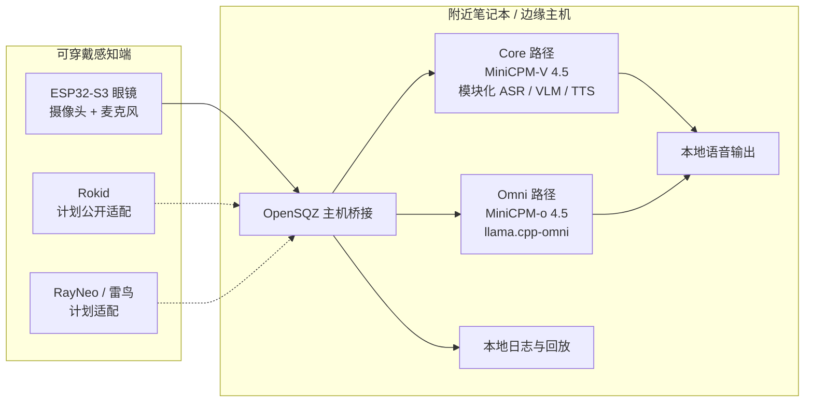

# OpenSQZ Glass

### 眼镜负责感知，近端设备负责本地智能

**一个面向本地优先视觉辅助的开源研究平台，将轻量的第一视角感知与附近笔记本或边缘主机上的多模态推理解耦。**

[English](README.md) · [快速启动](#快速启动) · [硬件教程](hardware/AI_GLASSES_OPEN_SOURCE_REPORT.md) · [ACL 2026 论文](https://aclanthology.org/2026.acl-demo.82/) · [安全与隐私](docs/safety_privacy.md) · [路线图](docs/roadmap.md)


*OpenSQZ Glass 3D 打印镜架与感知硬件。*

> **重要说明：** 大模型不在 ESP32 眼镜上运行。OpenSQZ Glass 采用传感-计算分离：可穿戴端采集第一视角图像和声音，由用户控制的附近电脑在本地完成推理和语音生成。

> **研究边界：** OpenSQZ Glass 是研究原型，不是经过认证的导航辅助、医疗设备、安全关键系统或生产就绪的 Skill 平台。

## News

- **[2026.08.04]** 📢📢📢 我们正式采用 **OpenSQZ Glass** 作为统一项目名称，汇集感知硬件、本地多模态运行时和相关研究方向。[查看项目全景](#方向与成熟度)。
- **[2026.08.03]** 🥳🥳🥳 我们将实验性的 [OmniRuntime](runtime/openglass_omni/README.md) 合入统一仓库，包括控制面板、ESP32 桥接、Prompt 切换和本地 Session 录制/回放工具。[立即体验！](#快速启动)
- **[2026.07.22]** 🔥🔥🔥 我们完整开源首版硬件材料，包括[可编辑 STEP 镜架](hardware/cad_3d_print/A02_frame_source.step)、[3MF 打印摆盘](hardware/cad_3d_print/A03_print_plate.3mf)、[净化后的 BOM](hardware/bom/A01_bom_public.xlsx)、项目图片和[中英文制作教程](hardware/AI_GLASSES_OPEN_SOURCE_REPORT.md)。欢迎动手复现！
- **[2026.07.21]** ⭐️⭐️⭐️ OpenSQZ Glass 在 **WAIC 2026** 大会现场展出，并获 InfoQ 专题报道：[《OpenSQZ Glass：让端侧全双工全模态模型进入第一视角的可穿戴世界》](https://www.infoq.cn/article/UZ1j5LXmjNgiCfu5QL0s)。
- **[2026.07.20]** 🚀🚀🚀 我们的 3D 打印可穿戴硬件 Demo **OmniGlass-Edge** 被 [UbiComp/ISWC 2026](https://www.ubicomp.org/ubicomp-iswc-2026/) Posters & Demos 接收！欢迎查看[开源硬件教程](hardware/AI_GLASSES_OPEN_SOURCE_REPORT.md)。
- **[2026.07]** 📄📄📄 我们的 ACL 2026 System Demonstration 论文[《OpenGlass: A Sensing-Computing Split Architecture for Local MLLM-Driven Real-Time Visual Assistance》](https://aclanthology.org/2026.acl-demo.82/)已正式收录于 ACL Anthology。[阅读论文介绍](papers/acl2026.md)。
- **[2026.04.26]** 🎉🎉🎉 **OpenGlass 感知-计算分离系统**作为 OpenSQZ Glass 项目中的一个研究方向，被 [ACL 2026 System Demonstrations](https://aclanthology.org/2026.acl-demo.82/) 接收！
- **[2026.03.03]** 🔥🔥🔥 OpenGlass 仓库正式发布，首批开放 ESP32 感知固件和评测脚本。[立即体验！](#快速启动)

## 项目概览

OpenSQZ Glass 将数条相关研究方向放在同一个仓库中，但并不把它们包装成一个已经完成的产品。它们共享一个简单的核心思想：


*UbiComp/ISWC 硬件方向的系统示意图，改编自 Figure 1；其中网络凭据已替换为适合公开仓库的本地配置提示。*

| 眼镜端 | 近端主机 | 本仓库提供 |
| --- | --- | --- |
| ESP32-S3 摄像头和 PDM 麦克风采集第一视角信息 | 笔记本或边缘主机在本地运行 ASR/VLM/TTS 或 MiniCPM-o | 固件、主机桥接、评测工具、实验运行时、会话回放和硬件文档 |

感知设备、模型后端和论文方向是三个相互独立的维度。ESP32 是设备，MiniCPM-V 和 MiniCPM-o 是模型路径，ACL 或 UbiComp/ISWC 表示研究快照，而不是需要复制代码的独立产品分支。



实线表示当前公开仓库已有代码或材料；虚线设备链路属于计划内容，不能理解为已经发布的支持。

## 方向与成熟度

| 研究方向 | 设备 | 模型/后端 | 内容 | 成熟度 |
| --- | --- | --- | --- | --- |
| **ACL 2026 / OpenGlass-Core** | ESP32-S3 眼镜 | **MiniCPM-V 4.5**，模块化 ASR/VLM/TTS | 传感-计算分离、本地视觉辅助、评测和延迟材料 | 已发表的研究基线；复现材料已公开 |
| **UbiComp/ISWC Hardware** | OpenSQZ 3D 打印 ESP32 镜架 | 与后端无关 | CAD、打印摆盘、BOM、模块位置、装配和验证文档 | 公开草案；多项硬件事实仍需确认 |
| **OmniRuntime / ESP32** | ESP32-S3 眼镜 | **MiniCPM-o 4.5** + `llama.cpp-omni` | 控制面板、实时多模态桥接、Prompt 切换、录制和回放 | 实验性；维护者环境有运行记录，全新机器验证待完成 |
| **OmniRuntime / Rokid** | Rokid 眼镜 | MiniCPM-o 4.5 | APK 到主机的桥接和共用运行时 | 计划公开集成；当前公开仓库缺少必要的桥接源码和 APK |
| **后续设备适配** | RayNeo/雷鸟等眼镜 | 待定 | 新增设备专属传输适配层 | 计划中；目前没有公开实现 |

**当前开发默认路径：** MiniCPM-o 4.5 是目前默认的实验运行时。ACL 2026 系统则是围绕 MiniCPM-V 4.5 构建的独立、可复现研究快照；它是 OpenSQZ Glass 的一部分，不代表整个项目的全部定位。

## 设备状态

| 设备系列 | 已公开材料 | 当前状态 |
| --- | --- | --- |
| **ESP32-S3 原型** | 摄像头/PDM 固件、设备表格式、主机桥接、评测脚本、CAD/BOM/教程 | 当前主要公开感知路径；需要用户配置本地 Wi-Fi 和 DHCP 地址 |
| **Rokid** | 面板链路入口和文档引用 | 无法从当前公开仓库全新 clone 后运行，因为必要的桥接源码和 APK 尚未公开 |
| **RayNeo/雷鸟** | 暂无适配源码 | 作为未来的独立设备边界预留，目前不支持 |

## 快速启动

控制面板的目标是：完成一次性环境准备后，后续实验可以一键重复启动。它不会替用户下载模型权重、clone 上游仓库、编译 `llama.cpp-omni` 或烧录 ESP32。

> **当前全新 clone 状态：** 面板本身可以从仓库根目录直接启动,但整套链路仍需手动准备四样仓库外的资源:`llama.cpp-omni` 编译结果、MiniCPM-o GGUF 权重、FunASR 模型、以及 ESP32 固件里的 Wi-Fi 凭据。这几项都不在本仓库内,需按以下说明安装。

### 1. 前置条件

目前维护者实际使用的路径包括：

- Windows 11、Python 3.10 和已激活的 Conda 环境。
- NVIDIA GPU，以及支持 CUDA 的 `llama.cpp-omni` 编译结果。
- Visual Studio 2022 C++ Build Tools 和 CMake。
- Arduino IDE 与 ESP32 开发板支持，用于烧录固件。
- 存放在仓库之外的 MiniCPM-o 4.5 GGUF 权重。
- ESP32 眼镜和主机共同连接的本地 Wi-Fi。

本仓库不分发模型权重。

### 2. Clone 上游项目的 master 分支

三个仓库必须保持相互独立，不要把 OpenSQZ Glass 的文件复制进 MiniCPM-o-Demo。

当前公开启动器采用与面壁同步的四进程链路：`llama-omni-server` -> `worker` -> `gateway` -> `demo`，对应两个上游项目仍在维护的 `master` 分支。

```powershell
git clone --branch master https://github.com/tc-mb/llama.cpp-omni.git
cd llama.cpp-omni
cmake -B build -DCMAKE_BUILD_TYPE=Release -DGGML_CUDA=ON -DLLAMA_CURL=OFF
cmake --build build --config Release --target llama-omni-server -j
cd ..

git clone --branch master https://github.com/OpenBMB/MiniCPM-o-Demo.git
cd MiniCPM-o-Demo
python -m pip install -r requirements.txt
cd ..

git clone https://github.com/OpenSQZ/OpenGlass.git
cd OpenGlass
python -m pip install -r runtime/openglass_omni/requirements.txt

python -m pip install -r extensions/requirements-phase-b.txt   # 语音控制 + CV 漏斗（harness链路需要，只跑基础对话无需安装）

```


由于上游 `master` 分支会持续变化，每次完成 OpenSQZ Glass 运行时验证和正式发布时，都应记录实际测试过的 Commit SHA。上游更新可能改变端口、启动参数、通信协议、TTS 行为或进程所有权。

### 3. 准备模型文件

将 MiniCPM-o 4.5 GGUF 模块放在仓库之外的同一个目录中。当前启动器通过 `-m` 接收主模型路径；vision、audio、TTS 和 Token2Wav 文件应遵循当前 checkout 的 `llama.cpp-omni` 版本所要求的目录结构。

```text
MiniCPM-o-4_5-gguf/
├── MiniCPM-o-4_5-Q4_K_M.gguf
├── vision/
├── audio/
├── tts/
└── token2wav-gguf/
```

准确文件名和下载方法以 [`llama.cpp-omni` 的 prerequisites](https://github.com/tc-mb/llama.cpp-omni#prerequisites) 为准。

### 4. 登记 ESP32 眼镜

创建会被 Git 忽略的本地设备表：

```powershell
Copy-Item examples/configs/devices.example.json runtime/openglass_omni/devices.json
```

编辑 `runtime/openglass_omni/devices.json`：

```json
{
  "devices": [
    {
      "name": "我的眼镜",
      "esp32_host": "你的 ESP32 IP",
      "esp32_port": 80,
      "rotate": 0
    }
  ]
}
```

- `name` 是面板下拉框显示的眼镜 ID。
- `esp32_host` 是 ESP32 启动后在串口监视器中打印的 DHCP 地址。
- `rotate` 是摄像头顺时针旋转角，只能是 `0`、`90`、`180` 或 `270`。
- 本地设备表已被 Git 忽略，不要提交私人设备地址。

### 5. 配置当前启动器

把 [`runtime.example.json`](runtime/openglass_omni/runtime.example.json) 复制为
同目录下的 `runtime.local.json`，填写本机路径。面板启动时读取它，
用其中的值覆盖 `panel.py` 里的默认路径：

```json
{
  "conda_env": null,
  "minicpm_demo_root": "D:\\path\\to\\MiniCPM-o-Demo",
  "llama_server": "D:\\path\\to\\llama.cpp-omni\\build\\bin\\Release\\llama-omni-server.exe",
  "llama_model": "D:\\path\\to\\MiniCPM-o-gguf\\MiniCPM-o-4_5-Q4_K_M.gguf",
  "asr_model": "D:\\path\\to\\LocalASRmodel\\speech_paraformer-large_asr_nat-zh-cn-16k-common-vocab8404-online",
  "glasses": { "ssid": "你的WiFi", "psk": "你的WiFi密码" }
}
```

| 配置内容 | 位置 | 说明 |
| --- | --- | --- |
| MiniCPM-o-Demo 目录 | `runtime.local.json` 的 `minicpm_demo_root` | 包含上游 `worker.py` / `gateway.py` 的绝对路径 |
| `llama-omni-server` | `llama_server` | `llama.cpp-omni/build` 下的编译结果 |
| 主 GGUF 模型 | `llama_model` | MiniCPM-o 4.5 主 GGUF 的绝对路径 |
| ASR 模型 | `asr_model` | FunASR 流式模型目录，②③④ 链路的语音控制用 |
| 眼镜 Wi-Fi | `glasses.ssid` / `glasses.psk` | Rokid 链路启动 APK 时传入；留空则该链路连不上眼镜，其余链路不受影响 |
| 眼镜名称/IP/旋转角 | `runtime/openglass_omni/devices.json` | 每副 ESP32 眼镜一条记录 |
| Prompt 预设 | [`panel.py` 的 `CONFIG["presets"]`](runtime/openglass_omni/panel.py) | 面板中显示的交互 Prompt |

> 面板首次启动时会在 `<minicpm_demo_root>/certs/` 下自签一对 TLS 证书,供 gateway(8006)和语音控制 harness(8021)的 `wss` 连接使用。

### 6. 配置并烧录 Wi-Fi 固件

打开 [`CameraWebServer_PDM_Audio/CameraWebServer_PDM_Audio.ino`](CameraWebServer_PDM_Audio/CameraWebServer_PDM_Audio.ino)，填写 `YOUR_WIFI_NAME` 和 `YOUR_WIFI_PASSWORD`，选择正确的 ESP32-S3 开发板并上传。随后以 `115200` 波特率打开串口监视器，将分配到的 IP 写入本地 `devices.json`。

公开固件现在保留占位值。[`examples/configs/esp32_wifi.example.h`](examples/configs/esp32_wifi.example.h) 目前只是文档模板，尚未被固件 `include`；下一轮代码修改会把真实凭据迁移到被忽略的本地头文件。

### 7. 启动

激活安装 MiniCPM-o-Demo 时使用的同一个 Python 环境，在 OpenGlass 仓库根目录运行：

```powershell
python glasses_panel.py
```

在顶部选择**链路**、**眼镜**（③④ 还要选**判据**），点击 **一键启动**。

面板提供五条链路，其中 ESP32 的四档是递进的，每一档只比上一档多一件事：

| 链路 | 功能 | 启动的进程 |
| --- | --- | --- |
| ① 基础对话 | 通过眼镜与本地模型全模态双工对话 | llama → worker → gateway → esp32_bridge |
| ② 语音控制 | 能听懂「停一下 / 重新开始 / 找东西」 | llama → worker → gateway → harness→esp32_bridge |
| ③ 质量筛选 | 每秒多帧里挑最清晰的一张送模型 | 同 ② |
| ④ 完整防幻觉 | 坏图直接拦下并语音提示，不让模型看见 | 同 ② |
| Rokid | 反向链路，PC 开 18080 等 APK 连入 | llama → worker → gateway → rokid |

①～④ 是**互斥**的：它们都要独占眼镜的音频通道和图像端口，同一时间只能跑一条。

```text
llama-omni-server :22500
        -> worker :22400
        -> gateway :8006
        -> （②③④ 才有）harness :8021
        -> 眼镜客户端 / 第一视角 :8080
```

**判据档位**（只有 ③④ 需要选）决定漏斗用哪套标定参数：

- **严格判据** —— 有安全风险的场景，例如需要念字的药盒、路上指示牌等。该判据严格拒绝质量不佳的图像防止模型输出幻觉。
- **日常判据** —— 日常场景。

只有进程指示灯全部变绿、并且第一视角持续更新，才能说明链路就绪。
只看到面板 UI 打开，不能证明模型、声音、图像和响应链路已经跑通。

### 面板进程生命周期

- **停止**只停止当前设备桥接，保留共享的后端进程。
- **重启**使用当前选中的 Prompt 重启设备桥接。
- **全部停止**先让桥接进程完成会话落盘，再按相反顺序停止 gateway、worker 和模型后端。
- 正常关闭面板窗口时，会先执行同步清理，再退出面板 Python 进程。
- 强杀面板、突然关闭终端，或者使用当前面板以外启动的进程时，仍可能留下后台服务；重新运行前应检查监听端口。

```powershell
Get-NetTCPConnection -State Listen -ErrorAction SilentlyContinue |
  Where-Object LocalPort -in 22500,22400,8006,8080,18080
```

## 硬件教程

硬件方向与模型后端独立发布：

- [AI 智能眼镜开源报告（中文）](hardware/AI_GLASSES_OPEN_SOURCE_REPORT.md)
- [硬件发布概览](hardware/README.md)
- [可编辑 STEP 和 3MF 摆盘文件](hardware/cad_3d_print/README.md)
- [净化后的 BOM](hardware/bom/README.md)
- [安全与隐私边界](docs/safety_privacy.md)

当前公开材料包括可编辑 STEP、3MF 打印摆盘、净化后的 BOM 和确认可公开的项目图片。STL 导出、公开接线图、Pin Map、焊接教程、完整验证结果和装配视频暂未包含在当前发布中。

## 仓库结构

```text
OpenGlass/
├── glasses_panel.py                 # 实验控制面板的根目录入口
├── runtime/openglass_omni/          # 面板、ESP32 桥接、录制与回放
├── CameraWebServer_PDM_Audio/       # ESP32-S3 摄像头 + PDM 麦克风固件
├── eval_benchmark/                  # ACL/Core 评测和延迟脚本
├── hardware/                        # CAD、BOM、图片和中英文硬件教程
├── papers/acl2026.md                # ACL/Core 论文页面
├── docs/                            # 架构、快速上手、安全和路线图
├── examples/configs/                # 净化后的本地配置模板
└── assets/                          # 原型照片、架构图和 Logo
```

上游模型项目和模型权重保持为外部依赖，不复制进本仓库。

## 已知限制

- 语音技能切换时的指令注入在当前 `/v1/realtime` 协议下不生效（协议没有对应字段），模型只能依赖 system prompt 完成任务。
- 「基础对话」与 harness 链路各自带一套第一视角前端和录制模块，仓库中存在两份同名文件，互不影响但容易混淆。
- Prompt 仍写在 `panel.py` 中，独立的 `prompts.json` 尚未接入。
- ESP32 Wi-Fi 仍需修改 tracked `.ino`，本地 Wi-Fi 头文件模板尚未接入。
- 正常关窗会执行清理，但异常退出可能留下子进程或外部启动的进程。
- 当前公开仓库没有 Rokid 桥接源码或 APK。
- RayNeo/雷鸟支持处于计划阶段，尚未实现。
- 长时间 Omni 会话、可靠打断、Session 重启和 Skill 注入仍是实验问题，不是已经解决的平台能力。
- 电池续航、舒适性、充电/调试行为、自动对焦、接线和最终打印参数仍需验证。
- 模型回答可能出错或延迟，不能用于经过认证的导航或安全关键决策。

剩余工作见[路线图](docs/roadmap.md)和[发布检查表](docs/release_checklist.md)。

## 论文与引用

ACL 2026 论文对应 OpenGlass-Core 研究快照，并不代表 OpenSQZ Glass 的全部范围，也不包含后续 MiniCPM-o 运行时和硬件方向的全部工作。

- **标题：** OpenGlass: A Sensing-Computing Split Architecture for Local MLLM-Driven Real-Time Visual Assistance
- **作者：** Mengzhang Li、Yuan Yao
- **会议：** ACL 2026 System Demonstrations，第 829-839 页

[[ACL Anthology](https://aclanthology.org/2026.acl-demo.82/)] [[PDF](https://aclanthology.org/2026.acl-demo.82.pdf)] [[DOI](https://doi.org/10.18653/v1/2026.acl-demo.82)]

```bibtex
@inproceedings{li2026openglass,
  title={OpenGlass: A Sensing-Computing Split Architecture for Local MLLM-Driven Real-Time Visual Assistance},
  author={Li, Mengzhang and Yao, Yuan},
  booktitle={Proceedings of the 64th Annual Meeting of the Association for Computational Linguistics (Volume 3: System Demonstrations)},
  pages={829--839},
  year={2026}
}
```

## License 与贡献

OpenSQZ Glass 采用 [Apache License 2.0](https://www.apache.org/licenses/LICENSE-2.0) 开源许可。

欢迎通过 [OpenSQZ/OpenGlass](https://github.com/OpenSQZ/OpenGlass) 提交 Issue 和范围清晰的 Pull Request。贡献前请注意：

- 不要提交 Wi-Fi 凭据、私人 IP 设备表、模型权重、个人数据、未经处理的私有 Session 或本机绝对路径。
- MiniCPM-o-Demo 与 `llama.cpp-omni` 应保持为独立的上游 checkout，不要复制源码进本仓库。
- 如实标注实验性的设备/后端组合，不要声称生产就绪或通过安全认证。
- 修改运行时必须记录使用的上游分支和 Commit。
